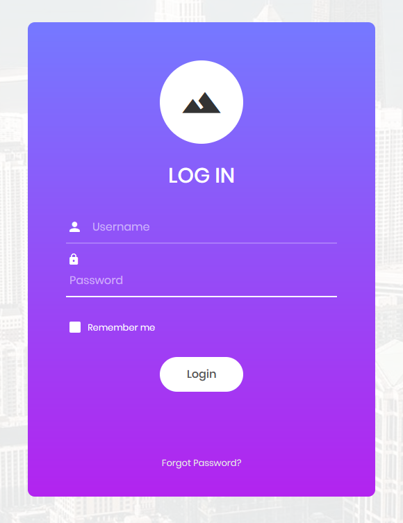
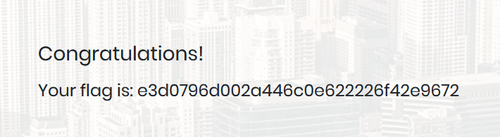

# Appointment

> What does the acronym SQL stand for? 

#### Structured Query Language

---

> What is one of the most common type of SQL vulnerabilities? 

#### SQL injection

---

> What does PII stand for? 

#### Personally Identifiable Information

---

> What does the OWASP Top 10 list name the classification for this vulnerability? 

#### A03:2021-Injection

---

> What service and version are running on port 80 of the target?

```console
$ nmap -sV 10.129.137.137
Starting Nmap 7.80 ( https://nmap.org ) at 2021-10-27 23:39 CEST
Nmap scan report for 10.129.137.137
Host is up (0.30s latency).
Not shown: 999 closed ports
PORT   STATE SERVICE VERSION
80/tcp open  http    Apache httpd 2.4.38 ((Debian))

Service detection performed. Please report any incorrect results at https://nmap.org/submit/ .
Nmap done: 1 IP address (1 host up) scanned in 25.58 seconds
```

#### Apache httpd 2.4.38 ((Debian)) 

---

> What is the standard port used for the HTTPS protocol? 

#### 443

---

> What is one luck-based method of exploiting login pages? 

#### brute-forcing 

---

> What is a folder called in web-application terminology? 

#### directory 

---

> What response code is given for "Not Found" errors? 

#### 404

---

> What switch do we use with Gobuster to specify we're looking to discover directories, and not subdomains? 

#### dir

---

> What symbol do we use to comment out parts of the code? 

#### \#

---

> Submit root flag 

If we navigate to the page we find a login form, given the challenge question maybe is SQL injection, so let's start with that



Maybe a basic SQL injection is enough, let's try with 
```
username=admin' -- -
password=a`
```



#### HTB{e3d0796d002a446c0e622226f42e9672}


