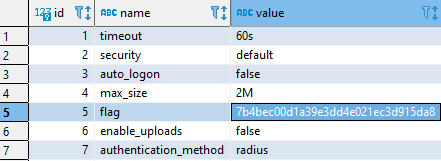

# Sequel

> What does the acronym SQL stand for? 

#### Structured Query Language

---

> During our scan, which port running mysql do we find? 

```console
$ nmap -sV 10.129.75.180
Starting Nmap 7.80 ( https://nmap.org ) at 2021-11-09 23:03 CET
Nmap scan report for 10.129.75.180
Host is up (0.31s latency).
Not shown: 999 closed ports
PORT     STATE SERVICE VERSION
3306/tcp open  mysql?
```

### 3306

---

> What community-developed MySQL version is the target running? 

### MariaDB

---

> What switch do we need to use in order to specify a login username for the MySQL service? 

### -u

---

> Which username allows us to log into MariaDB without providing a password? 

### root

---

> What symbol can we use to specify within the query that we want to display eveything inside a table? 

### *

---

> What symbol do we need to end each query with? 

### ;

---

> Submit root flag 

We can use some graphical tool linke DBEaver



### HTB{7b4bec00d1a39e3dd4e021ec3d915da8}

